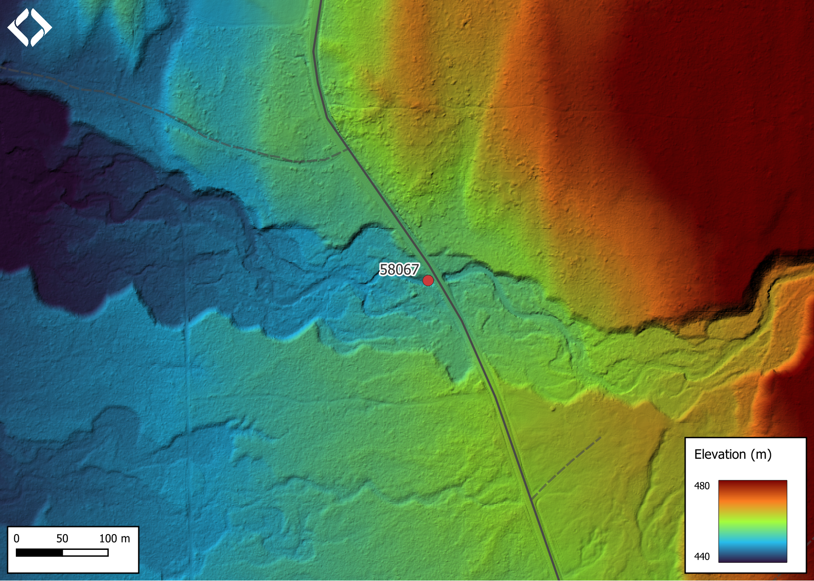

```{r setup-58067, eval = F}
knitr::opts_chunk$set(echo=FALSE, message=FALSE, warning=FALSE)
source('scripts/packages.R')
source('scripts/tables.R')

```

```{r  load-data-58067}
my_site <- 58067


```

`r fpr::fpr_appendix_title()`

## Site Location {.unnumbered}

PSCIS crossing `r as.character(my_site)` is located on `r fpr::fpr_my_pscis_info()` approximately 9km south of the
community of Witset, BC on `r fpr_my_pscis_info(col_pull = road_name)`. Crossing `r as.character(my_site)` was located
`r round(fpr::fpr_my_bcfishpass(col_pull = downstream_route_measure)*0.001, 1)`km upstream from the confluence with the
Bulkley River and is the responsibility of the Ministry of Transportation and Infrastructure.


## Background {.unnumbered}

At crossing `r as.character(my_site)`, `r fpr::fpr_my_pscis_info()` is a `r fpr::fpr_my_bcfishpass() %>% english::ordinal()` 
order stream with a watershed area upstream of the crossing of approximately `r fpr::fpr_my_wshd()`km^2^. The elevation 
of the watershed ranges from a maximum of `r fpr::fpr_my_wshd(col ='elev_max')`m to `r fpr::fpr_my_wshd(col = 'elev_site')`m 
at the crossing (Table \@ref(tab:tab-wshd-58067)). Upstream of `r fpr_my_pscis_info(col_pull = road_name)`, `r fpr::fpr_my_fish_sp()` 
have previously been recorded [@moe2020KnownBC;
@norris2020bcfishobs]. Of note, FISS records indicate that a steelhead spawning location is located approximatley 60m upstream 
of `r fpr_my_pscis_info(col_pull = road_name)` with the source reference noted as a personal communication with M. O'Neill 
from the Toboggan Creek Hatchery.

<br>


The stream was initially assessed on September 1st and 2nd, 2022, with much of this memo drafted then. However, as no 
coho were captured during extensive electrofishing in 2022, the site was revisited on September 24,2023 to scope for barriers downstream of 
`r fpr_my_pscis_info(col_pull = road_name)` and the confluence with the Bulkley River. Results from that assessment and
subsequent dip netting conducted are included in this report.


```{r tab-wshd-58067, eval = T}
fpr::fpr_table_wshd_sum(site_id = my_site) %>% 
  select(-'Elev Min') %>% 
  fpr::fpr_kable(caption_text = paste0('Summary of derived upstream watershed statistics for PSCIS crossing ', my_site, '.'),
           footnote_text = 'Elev P60 = Elevation at which 60% of the watershed area is above',
           scroll = F)

```

<br>

The Gramophone Creek watershed is designated as a Fisheries Sensitive Watershed under British Columbia's Forest and
Range Practices Act Government Actions Regulation, and the Oil and Gas Activities Act Environmental Management and
Protection Regulation. Fisheries Sensitive Watersheds have significant fish values and are sensitive to changes in
habitat [@porter2015].

<br>

@sterlingwoodgroupinc_1997TroutCreek report that the Trout Creek/Moricetown watershed project was an integrated
restoration plan designed for 14 watersheds found on either side of the Bulkley River with Gramophone Creek included
as one of the watersheds. A level I sediment source assessment was conducted in the watershed providing a risk
assessment of sedimentation by classifying road placement as on low, moderate, or
high-risk terrain.  Additionally, the lvel of consequence that sedimentation could have on fisheries values was also
assessed. Gramophone Creek scored lower than average overall with study blocks present that required level II assessment.

<br>

In a study conducted by @porter2015, the Gramophone Creek stream network was analysed using GIS methods to assess the
risk status related to fish habitat impact.  Risk status was determined by measuring nine habitat indicators including: 
road density, road density above the H60 line (the elevation above which 60% of the
watershed area lies), road density less than 100m from a stream, stream crossing density, proportion of stream logged,
proportion of fish-bearing stream logged, density of stream banks logged on slopes greater than 60%, peak flow index,
and road density on unstable slopes. Measured values were compared to a baseline to classify risk as low, moderate, or
high. Of the 71 watersheds included in the analysis, Gramophone Creek was notable for having all nine indicators rated
as high risk.

<br>

PSCIS stream crossing `r as.character(my_site)` was ranked as a high priority for follow up by the Canadian Wildlife
Federation because of significant amounts of habitat modelled upstream of the crossing. Upon review of an assessment
done on this crossing in 2012 by @gollner2013, @irvine2018AnalysisPriority also ranked it as a high priority for follow
up due to its high habitat value. A summary of habitat modelling outputs is presented in Table
\@ref(tab:tab-culvert-bcfp-58067). A map of the watershed is provided in map attachment 
[`r fpr::fpr_my_bcfishpass(col_pull = dbm_mof_50k_grid)`](fpr::fpr_my_mapsheet()).

`r if(identical(gitbook_on, FALSE)){knitr::asis_output("\\pagebreak")}`

<br>

```{r tab-culvert-bcfp-58067, eval = T}
fpr::fpr_table_bcfp(scroll = gitbook_on) 
```

<br>

```{r lidar-gramophone, fig.cap = 'Lidar generated digital elevation model of Gramophone Creek at Telkwa High Rd (data collected in 2019, taken from BC Open LiDAR data portal).',eval=T}

```

<br>

## Climate Change Risk Assessment

Preliminary climate change risk assessment data is presented in Tables \@ref(tab:tab-moti-58067) - \@ref(tab:tab-moti-58067-comments).

```{r tab-moti-58067, eval = T}
fpr_table_moti()
```

<br>

```{r tab-moti-58067-comments, eval = T}
fpr_table_moti_comments()
```

## Stream Characteristics at Crossing {.unnumbered}

At the time of the survey in 2022, PSCIS crossing `r as.character(my_site)` was un-embedded, non-backwatered, had an outlet drop
of `r fpr::fpr_my_pscis_info(col_pull = outlet_drop_meters)`m and ranked as a `r fpr::fpr_my_pscis_info(col_pull =
barrier_result)` to upstream fish passage according to the provincial protocol [@moe2011Fieldassessment] (Table
\@ref(tab:tab-culvert-58067)). The crossing consisted of two pipes, with a very big outlet pool indicating the crossing
was undersized. The pipes were noted as in poor condition due to corrosion and the road prism at the site had
indications of significant erosion adjacent to the crossing. Water temperature was 
`r fpr::fpr_my_habitat_info(col_pull= 'temperature_c')`$^\circ$C, pH was `r fpr::fpr_my_habitat_info(col_pull = 'p_h')` 
and conductivity was `r fpr::fpr_my_habitat_info(col_pull = 'conductivity_m_s_cm')`uS/cm.

<br>


```{r tab-culvert-58067, eval = T}
fpr::fpr_table_cv_summary_memo()

```


```{r eval=F}
##this is useful to get some comments for the report
hab_site %>% filter(site == my_site & location == 'us') %>% pull(comments)
fpr::fpr_my_priority_info()

```

## Stream Characteristics Downstream {.unnumbered}

`r fpr::fpr_my_survey_dist(loc = 'ds')` in 2022 `r if(gitbook_on){knitr::asis_output("(Figures \\@ref(fig:photo-58067-01) -
\\@ref(fig:photo-58067-02)).")}else(knitr::asis_output("(Figure \\@ref(fig:photo-58067-d01))."))` 
`r fpr_my_habitat_paragraph(loc = 'ds')` There were abundant undercut banks available for cover. Some patches of gravel
were present suitable for rainbow, steelhead and coho spawning. Occasional deep pools were present suitable for juvenile
rearing and overwintering. Riparian vegetation was mixed deciduous and conifer old growth forest. The habitat was rated 
as `r fpr::fpr_my_priority_info(loc = 'ds')` value for salmonid rearing and spawning.

<br>

In 2023, the entire 2.6km between `r fpr_my_pscis_info(col_pull = road_name)` and the confluence with the Bulkley River was
surveyed with the stream delineated into two distinct sections.  The first was the ~800m long section from `r fpr_my_pscis_info(col_pull = road_name)` 
to the confluence with Wiggs Creek.  The second was 1.8km long and spanned from the Wiggs Creek confluence to the Bulkley River.  

<br>

The first section (from the road to Wiggs Creek) was noted as containing low water levels with sections of the stream completely
de-watered (particularly the first 300m below `r fpr_my_pscis_info(col_pull =road_name)`). There were isolated pools
to 0.6m deep scattered approximately 30 - 50m apart throughout the area surveyed and abundant algae present within areas of slow
and stagnant water. Failing banks were encountered with barbwire fence falling into the stream channel at multiple locations
along with sections of channel where extensive cattle trampling and manure deposition was evident. Surveyors also noted 
occasional pockets of gravel present suitable for resident and anadromous salmonid spawning. Overall, habitat was rated as high value.

<br>

In the second section surveyed - between the confluence of Wiggs Creek and the Bulkley River - at a location approximately
600m upstream from the confluence with the Bulkley, crews observed a 40m long canyon 
containing two rock outcrops located at the downstream and upstream ends of a 25m long rock chute (~25% gradient). 
The rock outcrops at both the bottom and the top of the chute were estimated at 1.7m high `r if(gitbook_on){knitr::asis_output("(Figures \\@ref(fig:photo-58067-07) - \\@ref(fig:photo-58067-08)).")}else(knitr::asis_output("(Figure \\@ref(fig:photo-58067-d04))."))`. 
The approximate UTM coordinates of the bottom end of the chute was noted as 9U.607989.6093242. Additionally, at the time 
of assessment, the ~300m upstream of the Bulkley River confluence the stream was de-watered almost entirely. Overall, the habitat was rated 
as high value.

<br>

## Stream Characteristics Upstream {.unnumbered}

`r fpr_my_survey_dist(loc = 'us')`
`r if(gitbook_on){knitr::asis_output("(Figures \\@ref(fig:photo-58067-03) - \\@ref(fig:photo-58067-06)).")}else(knitr::asis_output("(Figure \\@ref(fig:photo-58067-d02) - \\@ref(fig:photo-58067-d03))."))`
`r fpr_my_habitat_paragraph(loc = 'us')` There is a small beaver dam
\~500m upstream from the crossing. The stream is wide throughout with abundant cover and
some areas with gravels suitable for spawning. There is approximately
50m of open residential area on the right bank. The habitat was rated as
`r fpr::fpr_my_priority_info(loc = 'us')` value as an important
migration corridor containing suitable spawning habitat and having
moderate rearing potential.

<br>

## Fish Sampling {.unnumbered}

Electrofishing was conducted at 12 sites in 2022 with results summarised in Tables
\@ref(tab:tab-fish-site-58067) - \@ref(tab:tab-fish-dens-58067) and
Figure \@ref(fig:plot-fish-box-58067).

<br>

During the 2023 site visit, dip netting within the canyon, in the large pool immediately below the rock chute and rock
outcrops was conducted.  Six coho were captured ranging in size from 65 - 90mm `r if(gitbook_on){knitr::asis_output("(Figures \\@ref(fig:photo-58067-09) - \\@ref(fig:photo-58067-10)).")}else(knitr::asis_output("(Figure \\@ref(fig:photo-58067-d05))."))` 


## Structure Remediation and Cost Estimate {.unnumbered}

Should restoration/maintenance activities proceed, replacement of PSCIS
crossing `r as.character(my_site)` with a bridge
(`r fpr::fpr_my_pscis_info(col_pull = recommended_diameter_or_span_meters)`m
span) is recommended. The cost of the work is estimated at
\$`r format(fpr::fpr_my_cost_estimate(), big.mark = ',')` for a cost
benefit of `r fpr::fpr_my_cost_estimate(col_pull = cost_net)` linear
m/\$1000 and `r fpr::fpr_my_cost_estimate(col_pull = cost_area_net)`
m^2^/\$1000.

<br>

## Conclusion {.unnumbered}

Electrofishing in 2022 demonstrated that Gramophone Creek supports a healthy population of rainbow trout. However, the 
migration of anadromous fish such as coho and steelhead — up to the chute, canyon, and rock outcrops located ~600 meters 
upstream of the confluence with the Bulkley River depends on both migration timing and stream water levels. Water conditions, 
influenced by timing and quantity of precipitation are important, as evidenced by the dewatering observed in the first 300 meters 
of stream in late September 2023. Historical data, including the documented personal communication of a steelhead spawning location upstream 
of `r fpr_my_pscis_info(col_pull = road_name)`, indicates that steelhead are able to overcome the obstacles to fish passage
located at the canyon during higher flow periods. In contrast, no coho have ever been documented as captured upstream of 
the canyon features and their confirmed presence downstream of the canyon in 2023 suggests that these obstacles have consistently hindered 
their migration. Interestingly, the varied fork lengths of coho parr captured below the chute (65 - 90mm) in 2023 indicate likely
differing spawning times in 2022. This varied spawning timing, the relatively low height of the rock outcrops (~1.7 meters) and 
the gentle gradient of the 25-meter long chute (~25%) offer hope that high flow events coinciding with any period of
steelhead and coho migration timing may facilitate upstream passage to habitat upstream of these obstacles for both 
anadromous species.

<br>

There was `r fpr::fpr_my_priority_info(col_pull= upstream_habitat_length_km)`km of habitat modelled upstream of crossing
`r as.character(my_site)` with areas surveyed rated as  `r fpr::fpr_my_priority_info(sit = my_site, loc = 'us', col_pull = hab_value)` 
value for salmonid rearing and spawning. `r fpr::fpr_my_pscis_info()` is a large system with habitat suitable for numerous 
species including coho salmon and steelhead provided they can access above the canyon features at ~600m upstream from the
confluence with the Bulkley River. Nevertheless, the large outlet drop on the culverts, their poor condition and the 
crossing's location adjacent to the community of Witset, BC provides significant justification for proceeding with replacement
of the structures with with significant hope for community involvement in the project.  Also, as 
`r fpr::fpr_my_pscis_info(col_pull = road_name)` is a non-paved road with a crossing location that can be accessed from 
either side, the costs of the work are low when compared to paved road and highway options. Crossing `r as.character(my_site)` 
was ranked as a `r fpr::fpr_my_priority_info(col_pull = priority)` priority for proceeding to design for replacement.  


`r if(gitbook_on){knitr::asis_output("<br>")} else knitr::asis_output("\\pagebreak")`

<br>

```{r tab-habitat-summary-58067}
tab_hab_summary %>% 
  filter(Site  == my_site) %>% 
  fpr::fpr_kable(caption_text = paste0('Summary of habitat details for PSCIS crossing ', my_site, '.'),
                 scroll = F) 

```

<br>

```{r tab-fish-site-58067, eval=T}
fpr_table_fish_site()

```

<br>

```{r tab-fish-dens-58067, eval=T}
fpr_table_fish_density()

```

`r if(gitbook_on){knitr::asis_output("<br>")} else knitr::asis_output("\\pagebreak")`

```{r plot-fish-box-58067, fig.cap= my_caption, eval=T}
my_caption <- paste0('Densites of fish (fish/100m2) captured upstream of PSCIS crossing ', my_site, '.')

fpr_plot_fish_box() 

```

<br>

```{r photo-58067-01-prep, eval=T}
my_photo1 <- fpr::fpr_photo_pull_by_str(str_to_pull = '_d1_')

my_caption1 <- paste0('Typical habitat downstream of PSCIS crossing ', my_site, '.')


```

```{r photo-58067-01, fig.cap= my_caption1, out.width = photo_width, eval=gitbook_on}
grid::grid.raster(jpeg::readJPEG(my_photo1))
```

<br>

```{r photo-58067-02-prep}
my_photo2 <- fpr::fpr_photo_pull_by_str(str_to_pull = '_d2_')

my_caption2 <- paste0('Typical habitat downstream of PSCIS crossing ', my_site, '.')
```

```{r photo-58067-02, fig.cap= my_caption2, out.width = photo_width, eval=gitbook_on}
grid::grid.raster(jpeg::readJPEG(my_photo2))

```

<br>

```{r photo-58067-d01, fig.cap = my_caption, fig.show="hold", out.width= c("49.5%","1%","49.5%"), eval=identical(gitbook_on, FALSE)}

my_caption <- paste0('Left: ', my_caption1, ' Right: ', my_caption2)

knitr::include_graphics(my_photo1)
knitr::include_graphics("fig/pixel.png")
knitr::include_graphics(my_photo2)
```

```{r photo-58067-03-prep}
my_photo1 <- fpr::fpr_photo_pull_by_str(str_to_pull = '_u1_')

my_caption1 <- paste0('Typical habitat upstream of PSCIS crossing ', my_site, '.')
```

```{r photo-58067-03, fig.cap= my_caption1, out.width = photo_width, eval=gitbook_on}
grid::grid.raster(jpeg::readJPEG(my_photo1))
```

<br>

```{r photo-58067-04-prep}
my_photo2 <- fpr::fpr_photo_pull_by_str(str_to_pull = '_u2_')

my_caption2 <- paste0('Typical habitat upstream of PSCIS crossing ', my_site, '.')

```

```{r photo-58067-04, fig.cap= my_caption2, out.width = photo_width, eval=gitbook_on}
grid::grid.raster(jpeg::readJPEG(my_photo2))
```

```{r photo-58067-d02, fig.cap = my_caption, fig.show="hold", out.width= c("49.5%","1%","49.5%"), eval=identical(gitbook_on, FALSE)}

my_caption <- paste0('Left: ', my_caption1, ' Right: ', my_caption2)

knitr::include_graphics(my_photo1)
knitr::include_graphics("fig/pixel.png")
knitr::include_graphics(my_photo2)
```

```{r photo-58067-05-prep}
my_photo1 <- fpr::fpr_photo_pull_by_str(str_to_pull = '_u3_')

my_caption1 <- paste0('Typical habitat upstream of PSCIS crossing ', my_site, '.')
```

```{r photo-58067-05, fig.cap= my_caption1, out.width = photo_width, eval=gitbook_on}
grid::grid.raster(jpeg::readJPEG(my_photo1))
```

<br>

```{r photo-58067-06-prep}
my_photo2 <- fpr::fpr_photo_pull_by_str(str_to_pull = '_u4_')

my_caption2 <- paste0('Typical habitat upstream of PSCIS crossing ', my_site, '.')

```

```{r photo-58067-06, fig.cap= my_caption2, out.width = photo_width, eval=gitbook_on}
grid::grid.raster(jpeg::readJPEG(my_photo2))
```

```{r photo-58067-d03, fig.cap = my_caption, fig.show="hold", out.width= c("49.5%","1%","49.5%"), eval=identical(gitbook_on, FALSE)}

my_caption <- paste0('Left: ', my_caption1, ' Right: ', my_caption2)

knitr::include_graphics(my_photo1)
knitr::include_graphics("fig/pixel.png")
knitr::include_graphics(my_photo2)
```


```{r photo-58067-07-prep}
my_caption1 <- "Canyon with 1.5m high rock outcrop located ~600m upstream from the confluence with the Bulkley River."
my_photo2 <- "data/photos/58067/2023/20230924_141057_58067_k_ds2_canyon.JPG"
```


```{r photo-58067-07, fig.cap=my_caption1, eval=gitbook_on}
knitr::include_graphics(my_photo1)
```

```{r photo-58067-08-prep}
my_caption2 <- "25 meter rock chute located in the canyon"
my_photo2 <- "data/photos/58067/2023/20230924_141113_58067_k_ds2_chute.JPG"
```

```{r photo-58067-08, fig.cap = my_caption2, eval=gitbook_on}
knitr::include_graphics(my_photo2)
```

```{r photo-58067-d04, fig.cap = my_caption, fig.show="hold", out.width= c("49.5%","1%","49.5%"), eval=identical(gitbook_on, FALSE)}

my_caption <- paste0('Left: ', my_caption1, ' Right: ', my_caption2)

knitr::include_graphics(my_photo1)
knitr::include_graphics("fig/pixel.png")
knitr::include_graphics(my_photo2)
```


```{r photo-58067-09-prep}
my_caption1 <- "Coho parr captured below the lower rock outcrop and rock chute with dip nets during 2023 sampling."
my_photo1 <- "data/photos/58067/2023/IMG_2843_k_f1.JPG"
```

```{r photo-58067-09, fig.cap=my_caption1, eval=gitbook_on}
knitr::include_graphics(my_photo1)
```


```{r photo-58067-10-prep, fig.cap = "Coho parr captured below the falls with dip nets during 2023 sampling."}
my_caption2 <- "Coho parr captured below the lower rock outcrop and rock chute with dip nets during 2023 sampling."
my_photo2 <- "data/photos/58067/2023/IMG_2876_k_f3.JPG"
```


```{r photo-58067-10, fig.cap = my_caption2, eval=gitbook_on}
knitr::include_graphics(my_photo2)
```

```{r photo-58067-d05, fig.cap = my_caption, fig.show="hold", out.width= c("49.5%","1%","49.5%"), eval=identical(gitbook_on, FALSE)}

my_caption <- paste0('Left: ', my_caption1, ' Right: ', my_caption2)

knitr::include_graphics(my_photo1)
knitr::include_graphics("fig/pixel.png")
knitr::include_graphics(my_photo2)
```
